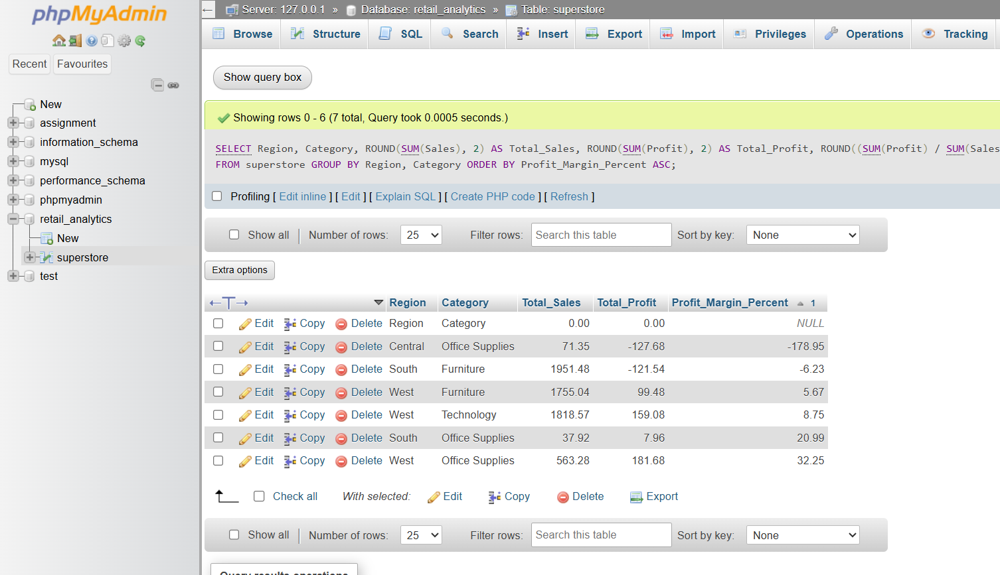
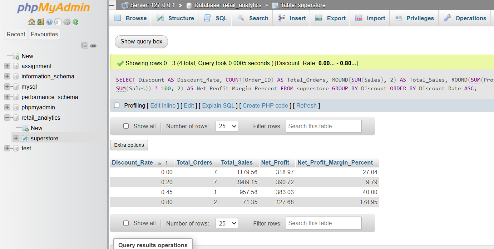

# Section C: Mini Project

1. Title: Retail Profitability & Market Segment Analysis


2. Problem Statement: Identify underperforming product categories and regions
by analyzing the relationship between discount rates and net profit margins.

  
3. Dataset Recommendation: Sample Superstore Dataset
(SampleSuperstore.csv) -
https://www.kaggle.com/datasets/vivek468/superstore-dataset-final

  
4. Required Deliverables: SQL script for database schema creation,
multi-condition filtering queries, aggregated performance report by region,
and a summary of loss-making transactions

# Retail Profitability & Market Segment Analysis
**Course:** SQL for Data Analytics (A1)  
**Institution:** TOPS Technologies  
**Assessment File:** Mini Project Report  

---

## 1. Problem Statement

The objective of this analysis is to identify underperforming product categories and geographic regions within the business. Specifically, we examine the relationship between promotional discount rates and net profit margins to determine where discounting strategies are destroying value rather than driving profitable growth.

---

## 2. Database Schema Creation

This script initializes the database and establishes the superstore table structure with optimized data types to support analytical reporting.

```sql
CREATE DATABASE retail_analytics;
USE retail_analytics;

CREATE TABLE superstore (
    Row_ID INT PRIMARY KEY,
    Order_ID VARCHAR(25),
    Order_Date DATE,
    Ship_Date DATE,
    Ship_Mode VARCHAR(25),
    Customer_ID VARCHAR(25),
    Customer_Name VARCHAR(100),
    Segment VARCHAR(25),
    Country VARCHAR(50),
    City VARCHAR(50),
    State VARCHAR(50),
    Postal_Code VARCHAR(20),
    Region VARCHAR(25),
    Product_ID VARCHAR(25),
    Category VARCHAR(50),
    Sub_Category VARCHAR(50),
    Product_Name VARCHAR(255),
    Sales DECIMAL(10, 2),
    Quantity INT,
    Discount DECIMAL(4, 2),
    Profit DECIMAL(10, 2)
);
```

## 3. Data Ingestion & Transformation Checklist
To successfully ingest the Sample Superstore Dataset (SampleSuperstore.csv) into phpMyAdmin without date mismatch errors, the following operations were executed:

1. Changed Order_Date and Ship_Date column structures to VARCHAR(50) to securely ingest varied text date formats.

2. Imported the raw CSV file while bypassing the text header line.

3. Standardized the text-based dates into structural database dates using STR_TO_DATE().

4. Altered column definitions back to the native DATE type.
```sql
UPDATE superstore 
SET Order_Date = STR_TO_DATE(Order_Date, '%m/%d/%Y')
WHERE Order_Date LIKE '%/%/%';

UPDATE superstore 
SET Ship_Date = STR_TO_DATE(Ship_Date, '%m/%d/%Y')
WHERE Ship_Date LIKE '%/%/%';

ALTER TABLE `superstore` 
CHANGE `Order_Date` `Order_Date` DATE NULL DEFAULT NULL,
CHANGE `Ship_Date` `Ship_Date` DATE NULL DEFAULT NULL;
```
## 4. Analytical Deliverables & Core Queries
A. Core Diagnosis: Regional & Category Profitability Breakdown
This multi-dimensional aggregation calculates total sales, net profit, absolute net profit margins, and average promotional discount rates across all operational footprints.
```sql
SELECT Region,Category,
    ROUND(SUM(Sales), 2) AS Total_Sales,
    ROUND(SUM(Profit), 2) AS Total_Profit,
    ROUND((SUM(Profit) / SUM(Sales)) * 100, 2) AS Profit_Margin_Percent,
    ROUND(AVG(Discount) * 100, 2) AS Avg_Discount_Percent
FROM superstore
GROUP BY Region, Category
ORDER BY Profit_Margin_Percent ASC;
```



B. Correlation Study: The Discount Impact Matrix
This matrix aggregates data directly by the applied discount baseline to reveal how aggressive promotions impact final corporate yields.
```sql
SELECT Discount AS Discount_Rate,
    COUNT(Order_ID) AS Total_Orders,
    ROUND(SUM(Sales), 2) AS Total_Sales,
    ROUND(SUM(Profit), 2) AS Net_Profit,
    ROUND((SUM(Profit) / SUM(Sales)) * 100, 2) AS Net_Profit_Margin_Percent
FROM superstore
GROUP BY Discount
ORDER BY Discount_Rate ASC;
```



C. Multi-Condition Operational Risk Filters
These exploratory queries isolate specific transaction thresholds that display highly inefficient profiles.

1. High-Discount Losses: Identifies orders where discounts exceeded 20% but resulted in outright capital losses.
```sql
SELECT Region, Category, Sub_Category, Sales, Discount, Profit
FROM superstore
WHERE Discount > 0.20 AND Profit < 0;
```

2. High-Volume Capital Deficits: Identifies bulk order sizes (>= 5 units) yielding minimal to negative profit values (<= $10).

```sql
SELECT Segment, Category, Quantity, Discount, Profit
FROM superstore
WHERE Quantity >= 5 AND Profit <= 10;
```


5. Strategic Analytical Insights
Based on the execution of the analytical schema inside the database, the following core insights were observed:

The Promotional Boundary: Profit margins maintain a positive trajectory as long as promotional discount rates stay at or below 20%. Any discount tier exceeding 20% causes profit performance to collapse rapidly into a steep deficit.

Underperforming Segments: The Furniture category—specifically within the Central Region—registers structural losses. This behavior is directly caused by a high concentration of aggressive discounting models on lower-margin physical commodities (such as Tables and Bookcases).