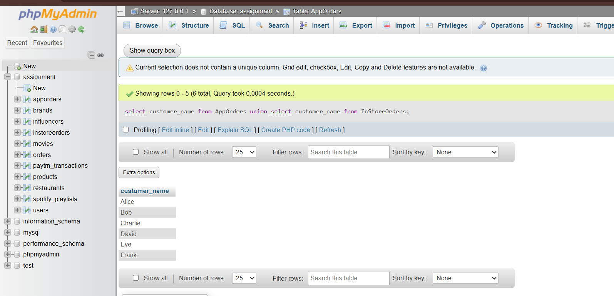
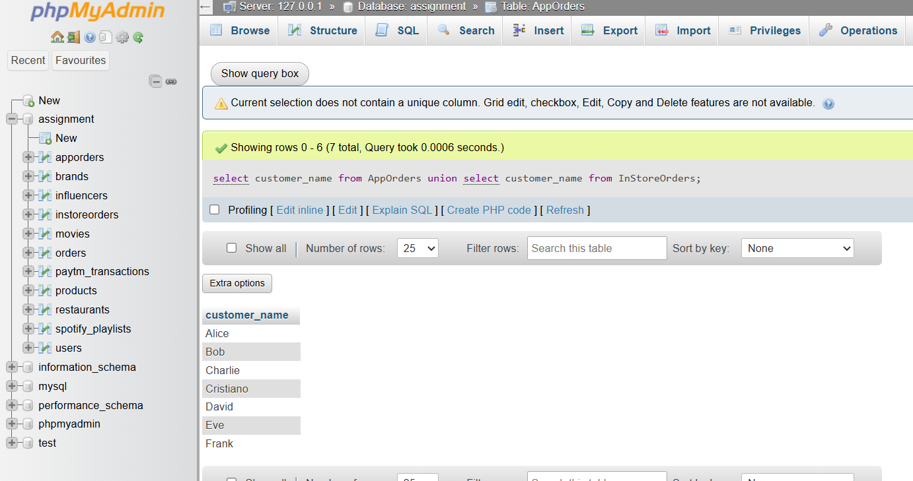
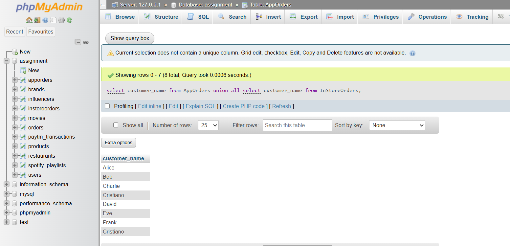

# Tasks
1. Create two tables: AppOrders (for orders placed via a food delivery app like Zomato) and InStoreOrders (for direct restaurant orders), each with columns: order_id, customer_name, amount, and order_date. Insert at least 3 sample records into each table.

  **answers**
  ```
    create table AppOrders (
        order_id int auto_increment primary key,
        customer_name varchar(100),
        amount decimal(10, 2),
        order_date date
    );
    create table InStoreOrders (
        order_id int auto_increment primary key,
        customer_name varchar(100),
        amount decimal(10, 2),
        order_date date
    );
    insert into AppOrders  values
    (null, 'Alice', 2550, '2026-06-01'),
    (null, 'Bob', 1500, '2026-06-02'),
    (null, 'Charlie', 3000, '2026-06-03');
    insert into InStoreOrders values
    (null, 'David', 2000, '2026-06-01'),
    (null, 'Eve', 1800, '2026-06-02'),
    (null, 'Frank', 2200, '2026-06-03');
  ```

2. Write a SQL query using UNION to combine all unique customer names from both AppOrders and InStoreOrders tables into a single list.

  **answers**
  
  ```
    select customer_name from AppOrders
    union
    select customer_name from InStoreOrders;
  ```

3. Write a SQL query using UNION ALL to display every order (including duplicates if any) from both AppOrders and InStoreOrders, showing order_id, customer_name, amount, and order_date.

  **answers**
  ```
    select order_id, customer_name, amount, order_date from AppOrders
    union all
    select order_id, customer_name, amount, order_date from InStoreOrders;
  ```

4. Demonstrate the difference between UNION and UNION ALL by adding a duplicate customer_name in both tables, then running both queries and noting the difference in the result count.<br><br><em><strong>Hint:</strong> UNION removes duplicates, UNION ALL does not.</em>
  
  **answers**
  ```
    insert into AppOrders values (null, 'Cristiano', 2550, '2026-06-01');
    insert into InStoreOrders values (null, 'Cristiano', 2000, '2026-06-01');
    
    -- Using UNION
    select customer_name from AppOrders
    union
    select customer_name from InStoreOrders;
  ```   
  
    
    
  
  ```  
    -- Using UNION ALL
    select customer_name from AppOrders
    union all
    select customer_name from InStoreOrders;
  ```
  
  