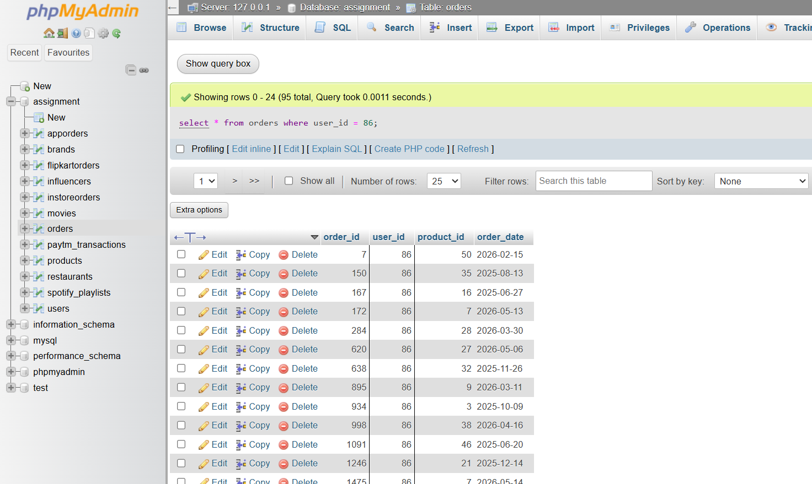
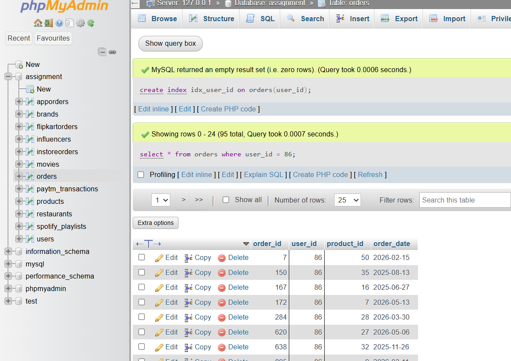

# Tasks
1. Run a SELECT query on a large 'orders' table (at least 10,000 rows) to find all orders for a specific user_id and measure the query execution time.

  **answers**
   
   
   
   ```
    select * from orders where user_id = 86;
   ```

2. Create an index on the user_id column of the 'orders' table and re-run the same SELECT query to measure the new execution time.<br><br><em><strong>Hint:</strong> Use CREATE INDEX idx_user_id ON orders(user_id); and compare the times before and after.</em>

  **answers**
    
    
    
    ```
      create index idx_user_id on orders(user_id);
      select * from orders where user_id = 86;

    ```

3. Use the EXPLAIN PLAN command to analyze how your SELECT query runs before and after adding the index, and write down the key differences you observe in the output.

  **answers**
    
    ```
      explain plan for select * from orders where user_id = 86;
      explain plan for select * from orders where user_id = 86;
    ```
    key differences observed:
    - Before adding the index, the query plan shows a full table scan, indicating that the database is reading all rows in the 'orders' table to find matches for the specified user_id.
    - After adding the index, the query plan shows an index scan, indicating that the database is using the index on the user_id column to quickly locate the relevant rows, resulting in improved query performance.

4. Write a query for a 'products' table that avoids a full table scan by using an index on the 'category' column to fetch all products in a specific category.

**answers**
   ```
    select * from products where category = 'Electronics';
   ```

5. Suppose your SELECT query on the 'orders' table is still slow even after adding an index. Use EXPLAIN PLAN and research at least one more optimization technique (other than indexing) using an AI tool like ChatGPT or Copilot, and describe how you would apply it.
   
   **answers**
   ```
    explain plan for select * from orders where user_id = 86;
   ```
   researching optimization techniques, one approach to improve query performance is to partition the 'orders' table based on a relevant column, such as 'order_date'. By partitioning the table, the database can limit the number of rows it needs to scan for queries that filter by date ranges, which can significantly reduce execution time.