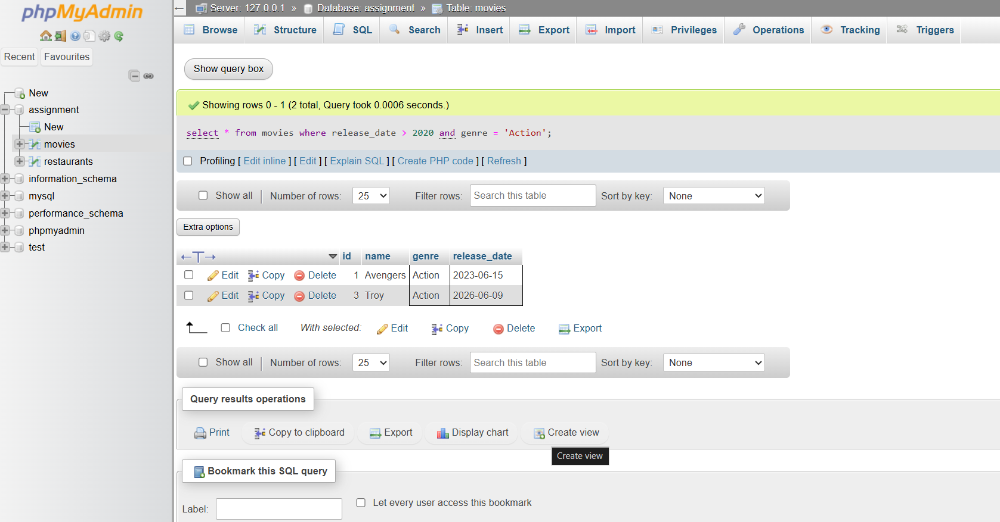

# Tasks
1. Write an SQL query to select all restaurants from a table named 'restaurants' where the rating is greater than or equal to 4.5.

 **answers** 
 
 ```
 select * from restaurants where rating >= 4.5;
 ```

2. In a table called 'movies', filter and display only the movies released after 2020 and with genre 'Action' using the WHERE clause and AND operator.
 
 **answers**
 
 ```
 select * from movies where release_date > 2020 and genre = 'Action';
 ```


3. Given a table 'products' with columns (id, name, price, category), write a query to find all products not in the 'Electronics' category or with a price less than 500.

    **answers**
    ```
    select * from products where category != 'Electronics' or price < 500;
    ```


4. Write an SQL query for a table 'users' to show all users who are NOT from 'Ahmedabad' and have more than 1000 followers.<br><br><em><strong>Hint:</strong> Use the NOT operator combined with AND.</em>
   
    **answers**
    ```
    select * from users where city != 'Ahmedabad' and followers > 1000;
    ```