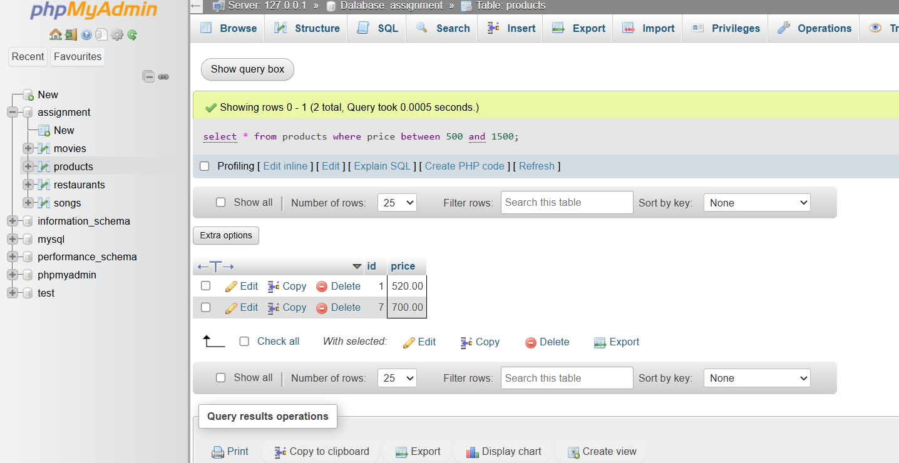
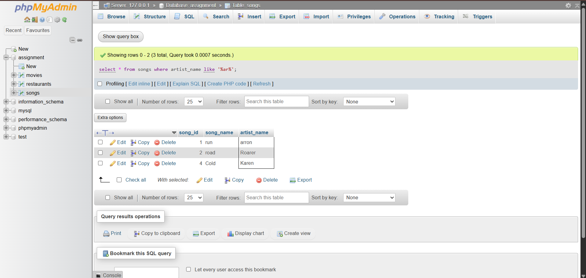

# Tasks
1. Write an SQL query to find all restaurants in a table called Restaurants whose names end with 'Cafe' using the LIKE operator.

    **answers**
    ```
    select * from restaurants where name like '%Cafe';
    ```

2. In a Flipkart-style Products table, use the BETWEEN operator to select all products with a price between 500 and 1500 rupees.

    **answers**
    
    ```
    select * from products where price between 500 and 1500;
    ```

3. Write an SQL query to display all users from a Users table whose city is either 'Ahmedabad', 'Surat', or 'Vadodara' using the IN operator.

    **answers**
    ```
    select * from users where city in ('Ahmedabad', 'Surat', 'Vadodara');
    ```

4. Given a table called Songs with columns song_name and artist_name, find all songs where the artist_name contains the letter sequence 'ar' anywhere in the name using the LIKE operator.<br><br><em><strong>Hint:</strong> Use wildcards on both sides of the pattern.</em>

    **answers**
    
    ```
    select * from songs where artist_name like '%ar%';
    ```