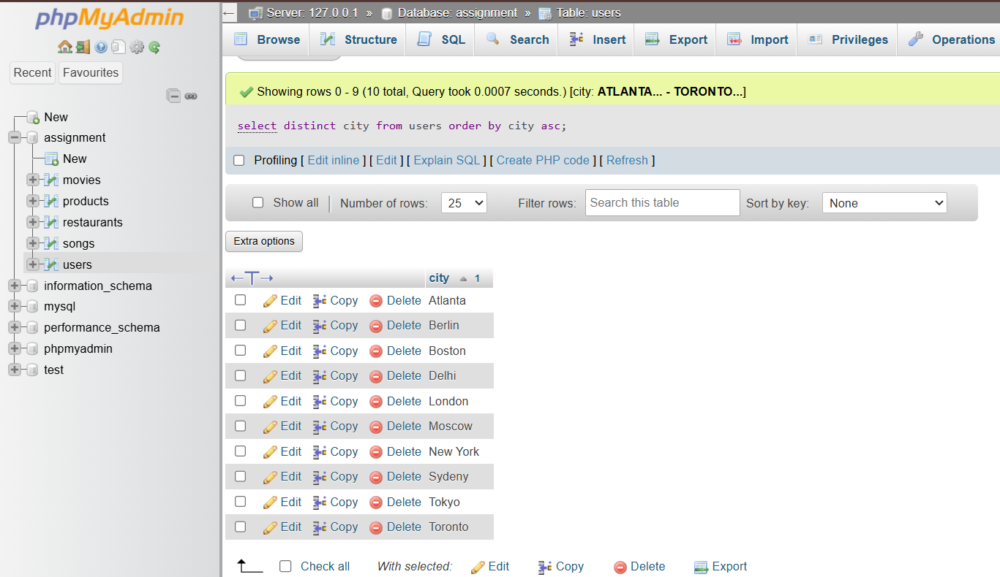

# Tasks
1. Write an SQL query using the DISTINCT keyword to find all unique payment methods used in the orders table of a food delivery app database.

   **answers**
   ```
     select distinct payment_method from orders;
   ```
2. Query the users table to list all cities where users have registered, but display each city only once and sort the result in alphabetical order (A-Z).

   **answers**
    
   ```
     select distinct city from users order by city asc;
   ```

3. Write an SQL query to select the top 5 most recent movie bookings from the bookings table, ordered by booking_date in descending order.

    **answers**
    ```
      select * from bookings order by booking_date desc limit 5;
    ```

4. From a products table containing Flipkart-style product data (id, name, category, sold_count), write an SQL query to retrieve the 10 products with the highest sold_count, displaying only product name and sold_count, sorted from highest to lowest.<br><br><em><strong>Hint:</strong> Use ORDER BY and LIMIT together to achieve this.</em>
   
    **answers**
    ```
      select name, sold_count from products order by sold_count desc limit 10;
    ```