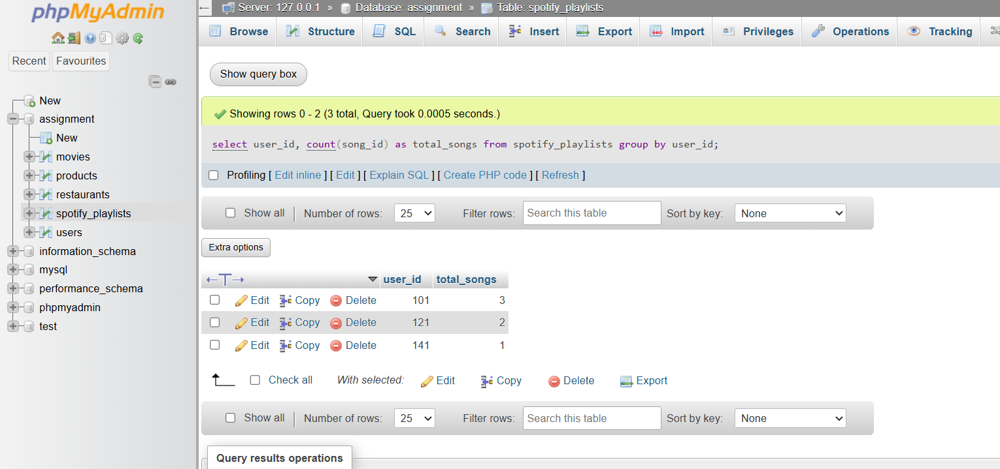
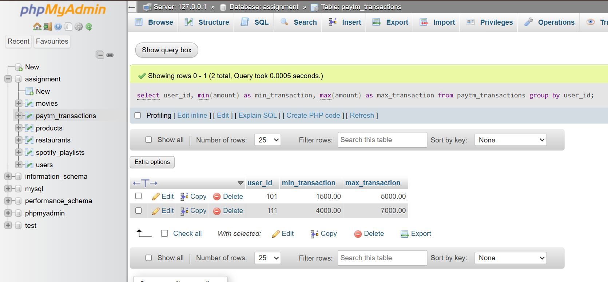

# Tasks
1. Write an SQL query using the SUM() function to calculate the total amount spent by users on food orders in a table food_orders (columns: order_id, user_id, amount) — imagine it's like Zomato's order history.

  **answers**
  ```
    select user_id, sum(amount) as total_spent
    from food_orders group by user_id;
  ```

2. Using the COUNT() function, find out how many songs a user has added to their playlist in a table spotify_playlists (columns: playlist_id, user_id, song_id).

  **answers**
  
  ```
    select user_id, count(song_id) as total_songs
    from spotify_playlists group by user_id;
  ```


3. Write an SQL query to get the average rating given to a movie in a table bookmyshow_reviews (columns: review_id, movie_id, rating), and round the result to 1 decimal place using the ROUND() function.<br><br><em><strong>Hint:</strong> Use AVG() with ROUND() to format the output.</em>

    **answers**
    ```
        select movie_id, round(avg(rating), 1) as average_rating from bookmyshow_reviews group by movie_id;
    ```

4. Find the minimum and maximum transaction values for a user from a table paytm_transactions (columns: txn_id, user_id, amount) — show both the smallest and largest transaction amounts.

    **answers**
    
    ```
        select user_id, min(amount) as min_transaction, max(amount) as max_transaction
        from paytm_transactions group by user_id;
    ```

5. Given a table myntra_orders (columns: order_id, user_id, total_price), write an SQL query to display the total number of orders, the average order value (rounded to 2 decimals), and the highest order value for each user_id.<br><br><em><strong>Constraint:</strong> Use GROUP BY to get results per user.</em>
    
    **answers**
    ```
        select user_id, count(order_id) as total_orders, round(avg(total_price), 2) as average_order_value, max(total_price) as highest_order_value from myntra_orders group by user_id;
    ```