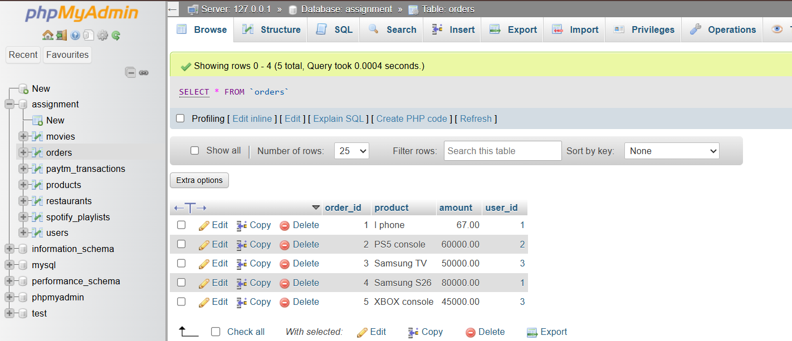

# Tasks
1. Create two tables in your SQL database: Users (user_id, username, city) and Orders (order_id, user_id, product, amount). Insert at least 3 users and 5 orders, making sure some users have no orders.

  **answers**
  
  ```
    create table Users (
        user_id int auto_increment PRIMARY KEY,
        username varchar(50),
        city varchar(50)
    );
    create table Orders (
        order_id int auto_increment PRIMARY KEY,
        product varchar(50),
        amount decimal(10, 2),
        user_id int references Users(user_id)
    );
  ```

2. Write an SQL query using INNER JOIN to list all usernames and their ordered products, showing only users who have placed at least one order.

  **answers**
  ```
    select u.username, o.product
    from Users u
    inner join Orders o on u.user_id = o.user_id;
  ```

3. Write an SQL query using LEFT JOIN to display all usernames along with their ordered products. For users who haven't placed any orders, show NULL for the product.

    **answers**
    ```
        select u.username, o.product
        from Users u
        left join Orders o on u.user_id = o.user_id;
    ```

4. Write an SQL query using RIGHT JOIN to show all orders and the corresponding username for each order. If an order has a user_id that doesn't exist in the Users table, display NULL for the username.<br><br><em><strong>Hint:</strong> Try deleting one user and keeping their order to test this case.</em>

    **answers**
    ```
        select o.product, u.username
        from Orders o
        right join Users u on o.user_id = u.user_id;
        
    ```

5. Suppose you want to analyze food delivery data like Zomato. Create a CustomerSegments table (segment_id, segment_name), and link it to Users with a foreign key. Write an SQL query to show each username, their segment name, and total order amount (use JOINs as needed).
    **answers**
    ```
        create table CustomerSegments (
            segment_id int auto_increment PRIMARY KEY,
            segment_name varchar(50)
        );
        
        alter table Users
        add column segment_id int references CustomerSegments(segment_id);
        
        select u.username, cs.segment_name, sum(o.amount) as total_amount
        from Users u
        left join Orders o on u.user_id = o.user_id
        left join CustomerSegments cs on u.segment_id = cs.segment_id
        group by u.username, cs.segment_name;
    ```