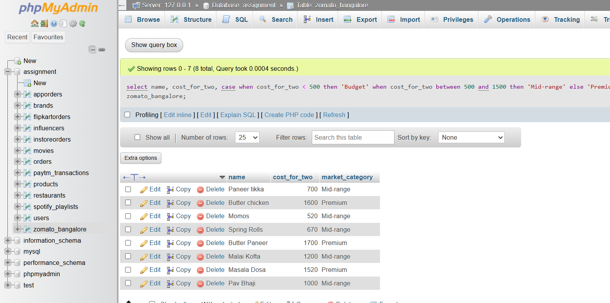

# Tasks
1. Write an SQL query to find the top 5 highest-rated restaurants in Koramangala, showing their name, average rating, and number of votes.

  **answers**
  ```
    select name, aggregate_rating, votes
    from zomato_bangalore
    where location = 'Koramangala'
    order by aggregate_rating desc
    limit 5,1;
  ```

2. Using the Zomato Bangalore dataset, create an SQL query that lists all unique cuisines available in Indiranagar along with the count of restaurants offering each cuisine.

   **answers**
   ```
    select cuisine, count(*) as restaurant_count
    from zomato_bangalore
    where location = 'Indiranagar'
    group by cuisine;
   ```

3. Write an SQL query to calculate the average cost for two people for each restaurant type (such as 'Cafe', 'Casual Dining', etc.) and order the results from most to least expensive.

   **answers**
   ```
    select restaurant_type, avg(cost_for_two) as average_cost
    from zomato_bangalore
    group by restaurant_type
    order by average_cost desc;
   ```

4. Find all restaurants that have a rating below 3.0 but more than 200 votes, and suggest a possible marketing action for these based on your findings.<br><br><em><strong>Hint:</strong> Think about discounts, partnerships, or events to improve ratings or attract new customers.</em>

  **answers**
  ```
    select name, aggregate_rating, votes
    from zomato_bangalore
    where aggregate_rating < 3.0 and votes > 200;
  ```
  possible marketing action: Offer targeted promotions or discounts to attract new customers, collaborate with food bloggers or influencers to improve visibility, and host events or tasting sessions to enhance customer experience and gather feedback for improvement.

5. Use ChatGPT to generate an SQL query that segments restaurants into three market categories: 'Budget' (cost for two < 500), 'Mid-range' (500-1500), and 'Premium' (>1500). Test and run the query on your dataset, and paste the working query in your submission.
   
   
   
   **answers**
   ```
    select name, cost_for_two,
    case 
        when cost_for_two < 500 then 'Budget'
        when cost_for_two between 500 and 1500 then 'Mid-range'
        else 'Premium'
    end as market_category
    from zomato_bangalore;
   ```