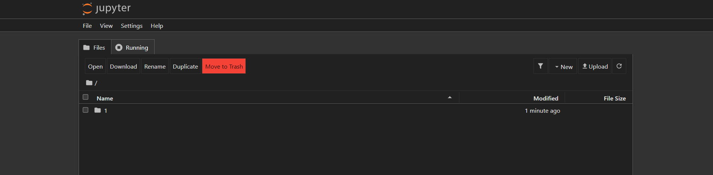
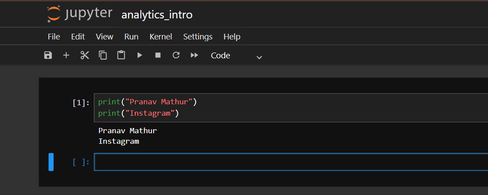
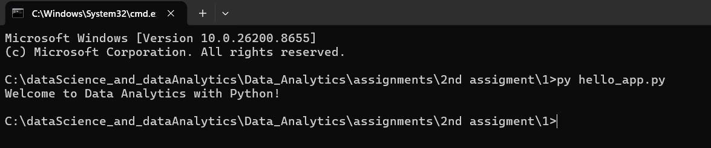

# Tasks
1. Install Anaconda on your system, open Anaconda Navigator, and launch Jupyter Notebook from it.

  **answers**
  
  

2. Create a new Jupyter Notebook file named analytics_intro.ipynb and write a cell that prints your name and your favorite app (like Instagram or Zomato) using the print() function.

  **answers**
  
  

3. Open VS Code or any code editor, create a Python script file called hello_app.py, and write code to print 'Welcome to Data Analytics with Python!'. Then, run this script from the terminal.

   **answers**

   

4. In Jupyter Notebook, add a new cell and write Python code to print the current year using the datetime module.<br><br><em><strong>Hint:</strong> Import datetime and use datetime.datetime.now().year.</em>
   
   **answers**
   ```
   import datetime
   print(datetime.datetime.now().year)
   ```