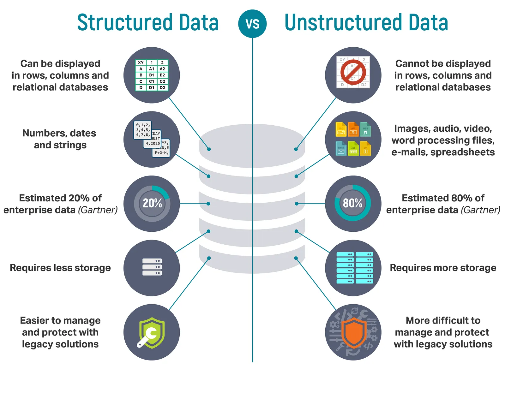
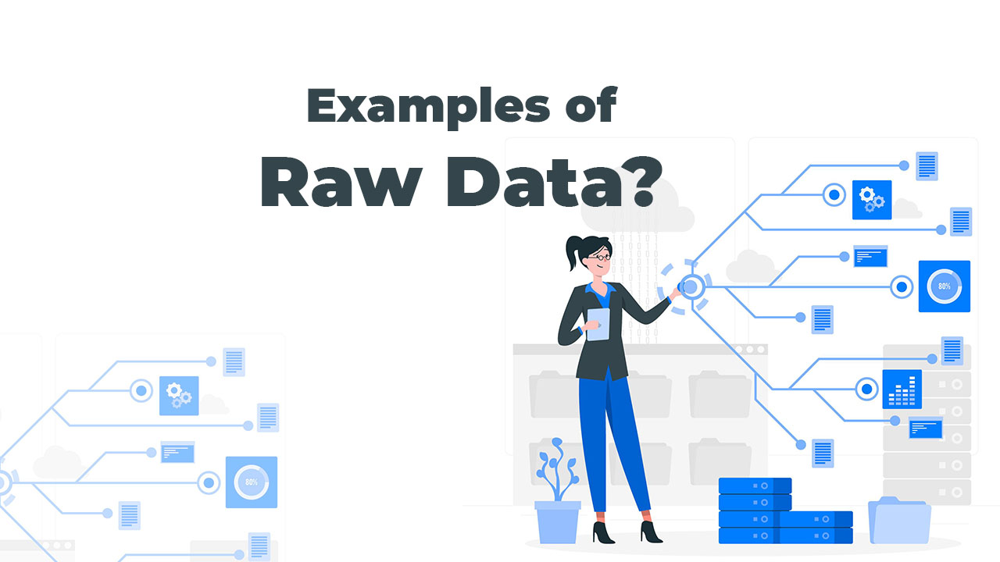

# What is data?
 1. data is a collection of a information i.e called data
 2. data is an collection of information i.e called data

# types of data?
 1. structured data
 2. unstructured data

 3. raw data

# What is structured data?
 1. strcutred data stored data in coloumn and row i.e structured data
   ```
   table(column * row)
   excel(column and cell)
   CSV(comma seperated value)
   ```
  **examples of employee table**
  | Employee ID | Name           | Department     | Position           | Salary  | Joining Date |
|-------------|----------------|----------------|--------------------|---------|--------------|
| EMP001      | Aarav Sharma   | IT             | Software Engineer  | 65000   | 2022-03-15   |
| EMP002      | Priya Verma    | HR             | HR Manager         | 72000   | 2021-07-10   |
| EMP003      | Rohan Mehta    | Finance        | Accountant         | 58000   | 2020-11-05   |
| EMP004      | Neha Kapoor    | Marketing      | Marketing Executive| 60000   | 2023-01-20   |
| EMP005      | Karan Singh    | Sales          | Sales Manager      | 75000   | 2019-09-12   |
| EMP006      | Ananya Patel   | IT             | Data Analyst       | 67000   | 2022-06-30   |
| EMP007      | Vivek Nair     | Operations     | Operations Lead    | 71000   | 2021-04-18   |
| EMP008      | Simran Kaur    | Customer Support | Support Executive | 50000   | 2023-08-25   |
| EMP009      | Rahul Joshi    | Finance        | Financial Analyst  | 69000   | 2020-12-01   |
| EMP010      | Meera Iyer     | Design         | UI/UX Designer     | 64000   | 2022-10-14   |     
# What is unstructured data?

 1. unstrcutured data stored data in format of text| audio| video|images etc. called unstructured type of data
 **examples of unstrucutred data**
   ```
   music.mp3
   music.mp4
   deatils.txt
   live.jpeg
   ```
   
   
# What is raw data format
 1. raw data format is in json,XML and object i.e called raw data format.
   **examples of raw data format**
   ```
   employee.json
   salary.json
   object data raw format
   or
   xml(xtensible markup language)
   ```
   
   